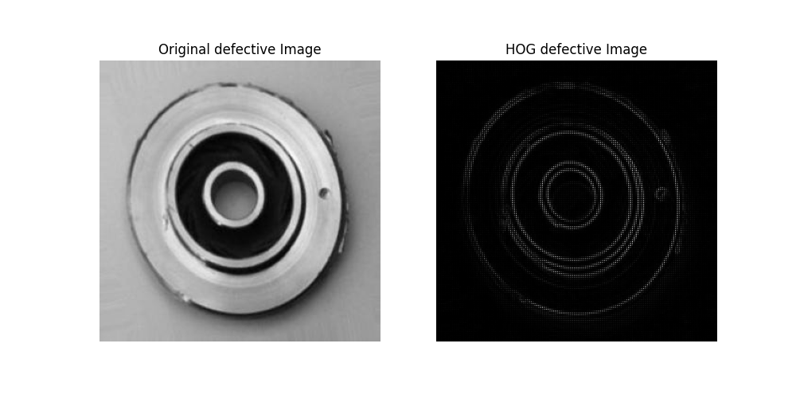
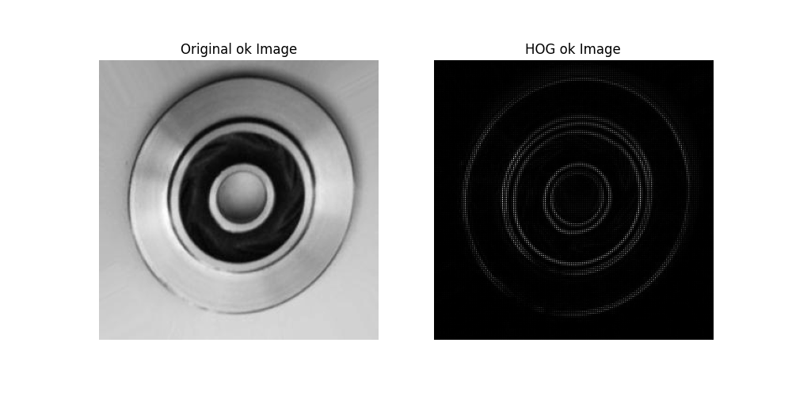

#### Simple Algorithm for detecting defective ball bearing images using [this](https://www.kaggle.com/datasets/ravirajsinh45/real-life-industrial-dataset-of-casting-product) real life industrial dataset

### dataset sample

### steps : 
1- reading the image files from the dataset (ok or def)

2- turning the images into black and white

3 - vectorizing each image using the Histogram of Oriented Gradients(HOG)

4- using K-Means clustering on the dataset

5- calculating the mean vector for each cluster and saving it

6- doing the steps 1-5 for the other dataset

7- comparing the vectorized version of the test images to each of the meaned vectors calculating their cosine similarity.

8- choosing the mean vector to which the test image vector is most similar to.

### results:
|   metric  |     value     |
|   :---:   |    :---:      |
|Accuracy   |     0.78      |
|Precision  |      0.83     |
|recall     |      0.66     |
|f1-score   |     0.732     |
